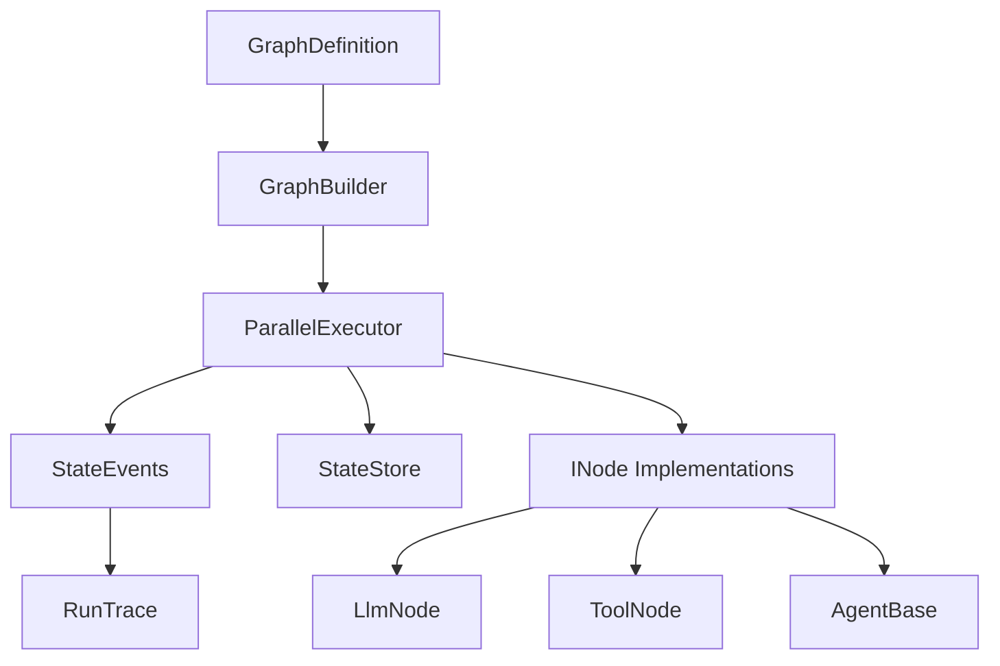

# GraphNexus

A .NET workflow engine for building agentic AI applications with graph-based execution.

## Overview

GraphNexus provides a declarative way to define and execute AI agent workflows using a directed graph structure. It supports parallel execution, state management, built-in nodes, LLM integration, and production-ready policies.

## Architecture



## Installation

```bash
dotnet add package GraphNexus.Core
```

## Quick Start

### 1. Define a Workflow

```csharp
var graph = new GraphBuilder("workflow-1", "Hello World")
    .Node(new PassthroughNode("start", "Start"))
    .Node(new LlmNode("llm-1", "Generate", openAiClient, "Say hello in a {{style}} style"))
    .Node(new PassthroughNode("end", "End"))
    .Edge("start", "llm-1")
    .Edge("llm-1", "end")
    .Entry("start")
    .Exit("end")
    .Build();

// Validate the graph
var errors = graph.Validate();
if (errors.Any())
    throw new InvalidOperationException(string.Join(", ", errors));
```

### 2. Execute the Workflow

```csharp
var store = new InMemoryStateStore();
var executor = new ParallelExecutor(store);

var initialState = WorkflowState.Create("workflow-1")
    .WithData("style", "friendly");

var request = new ExecutionRequest
{
    ExecutionId = Guid.NewGuid().ToString(),
    WorkflowId = "workflow-1",
    ThreadId = "thread-1",
    Graph = graph,
    InitialState = initialState
};

await foreach (var evt in executor.RunAsync(request))
{
    Console.WriteLine($"Event: {evt.EventType} - {evt.NodeId}");
}
```

### 3. Use Built-in Nodes

```csharp
// ToolNode - Execute custom tools
var addTool = new AddNumbersTool();
var toolNode = new ToolNode<AddNumbersInput, int>(
    "add-tool",
    "Add Numbers",
    addTool,
    state => new AddNumbersInput(
        (int)state.Data["a"]!,
        (int)state.Data["b"]!
    ),
    (state, result) => state.WithData("sum", result)
);

// LlmNode - Call LLMs
var llmNode = new LlmNode(
    "llm-1",
    "Chat",
    openAiClient,
    "Summarize: {{text}}",
    model: "gpt-4"
);

// PassthroughNode - Move data
var passNode = new PassthroughNode("pass-1", "Pass", "input_key", "output_key");
```

### 4. Build Agents

```csharp
public class MyAgent : AgentBase
{
    public MyAgent(ILlmClient client) 
        : base("agent-1", "MyAgent", client) { }

    protected override string BuildAgentPrompt(WorkflowState state)
        => state.Data.TryGetValue("task", out var task) 
            ? task?.ToString() ?? "" 
            : "";
}

var agent = new MyAgent(openAiClient);
```

### 5. Apply Policies

```csharp
var policyChain = new PolicyChain(
    new ContentFilterPolicy(),
    new RateLimitPolicy(maxRequestsPerMinute: 60),
    new RbacPolicy(rolePermissions)
);

var result = await policyChain.ValidateAsync(message);
if (!result.IsAllowed)
    throw new UnauthorizedAccessException(result.Reason);
```

## Graph Visualization

Export your graph to DOT or Mermaid format:

```csharp
var dot = GraphVisualizer.ToDot(graph);
var mermaid = GraphVisualizer.ToMermaid(graph);
```

## Key Concepts

| Concept | Description |
|---------|-------------|
| **GraphDefinition** | Immutable definition of nodes and edges |
| **GraphBuilder** | Fluent API for building graphs |
| **WorkflowState** | Immutable state passed between nodes |
| **INode** | Interface for executable nodes |
| **IStateStore** | Abstraction for state persistence |
| **ParallelExecutor** | Executes graphs with concurrency control |
| **StateEvent** | Events emitted during execution |

## Comparison

| Feature | GraphNexus | LangChain.NET | Temporal |
|---------|-----------|---------------|----------|
| Graph-based execution | ✅ | ❌ | ✅ |
| Parallel execution | ✅ | Limited | ✅ |
| Immutable state | ✅ | ❌ | ✅ |
| DOT/Mermaid export | ✅ | ❌ | ❌ |
| Policy layer | ✅ | ❌ | ✅ |
| Built-in nodes | ✅ | ✅ | ❌ |

## Requirements

- .NET 9.0+

## License

MIT
